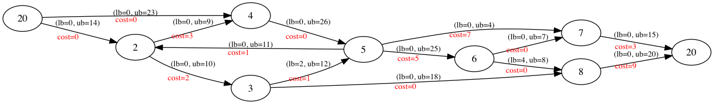

# Minimum-cost optimization using GLPK

## Minimum cost network flow



## Build and run

To build, run `./gradlew clean mainExecutable`. 

To execute, run `./build/exe/main/main`.

## Performance

System specs:
```
      Processor Name: Intel Core i7
      Processor Speed: 1.7 GHz
      Number of Processors: 1
      Total Number of Cores: 2
      L2 Cache (per Core): 256 KB
      L3 Cache: 4 MB
      Memory: 8 GB
```

Maximum resident set size reported using `/usr/bin/time -l`.

|           Task        |   (50K, 90K, 25K)  |  (50K, 90K, 250K)  | (100K, 100K, 100K) |
| ----------------------|:------------------:|:------------------:|:------------------:|
| glp_netgen            |       3.5s         |        3.2s        |     10.6s          |
| glp_mincost_relax4    |       24.9s        |      1261.6s       |     659.4s         |

|           Task        |   (15K, 5M, 25K)   |   (15K, 1M, 25K)   |  (15K, 100K, 25K)  |
| ----------------------|:------------------:|:------------------:|:------------------:|
| glp_netgen            |       36.7s        |        6.45        |        1.31s       |
| glp_mincost_relax4    |       8.73s        |        3.05s       |        1.80s       |
| Max RSS               |       696MB        |        142MB       |        31MB        |

The tuple (N, A, S) represents a problem instance, where:

* N = number of nodes
* A = number of arcs
* S = total supply

## References

* [GLPK](https://www.gnu.org/software/glpk/)
* [GLPK Wikibook](https://en.wikibooks.org/wiki/GLPK)
* [GLPK Graph and Network Routines](http://www.chiark.greenend.org.uk/doc/glpk-doc/graphs.pdf)
* [DIMACS Implementation Challenge: Network Flows and Matchings](http://dimacs.rutgers.edu/pub/netflow/)
* [DIMACS-Graphviz](https://gist.github.com/maelvalais/755c16db4681e3a671c1)
* [MIT 15-082j](https://ocw.mit.edu/courses/sloan-school-of-management/15-082j-network-optimization-fall-2010/)
* [Network Programming, Katta Murty](http://www-personal.umich.edu/~murty/books/network_programming/)
* [Network Optimization: Continuous and Discrete Models, Dmitri Bertsekas](http://web.mit.edu/dimitrib/www/netbook_Full_Book.pdf)

## TODO

* Use glp_netgen to test performance to large graphs
* Update the dimacs_to_dot.py script
* Better variable names
* Function for extracting the solution
* Function for converting a custom input in to DIMACS. Format:
```
    producer_id capacity
    ...
    consumer_id capacity
    ...
    producer_id consumer_id cost
    ...
```
* Create unit test
* Hook up project with Travis
* Rename binary, create library, update gradle.build
* Ribify GLPK?
