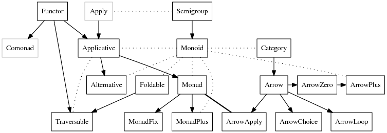
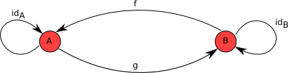

# Sketches for Haskell

> ...il est vrai que l’appétit ne saurait toujours parvenir entièrement à toute la perception, où il tend, mais il en obtient toujours quelque chose, et parvient à des 
perceptions nouvelles. (G. W. Leibniz)

## History

* J. Backus. Can Programming Be Liberated from the von Neumann Style? A Functional Style and Its Algebra of Programs. 
[link](https://www.thocp.net/biographies/papers/backus_turingaward_lecture.pdf)  
    * Programming models  
       * Foundations: tersness, completeness  
       * History sensitivity: states are not programs  
       * Abstraction: process is not computation  
    * von Neumann architecture  
       * Programming language replicates machine architecture  
       * "The assignment statement is the von Neumann bottleneck of programming languages and keeps us thinking in word-at-a-time terms..."  
       * Statements vs expressions: imperatives vs compositions  
       * "Applicative computing systems' lack of storage and history sensitivity is the basic reason they have not provided a foundation for computer design." (cf. FPGA)  
    * Framework, composable parts, combining forms  
        * "Let us distinguish two parts of a programming language. First, its _framework_ gives the overall rules of the system, and second, its changeable parts, whose existence is anticipated by the framework but whose particular behavior is not specified by it."
        * "Perhaps the most important element in providing powerful changeable parts in a language is the availability of combining forms that can be generally used to build new procedures from old ones."

* P. Hudak, J. Hughes, S. P. Jones, P. Wadler. A History of Haskell: Being Lazy with Class. [link](http://haskell.cs.yale.edu/wp-content/uploads/2011/02/history.pdf)  
    * Haskell is lazy  
    * Haskell is pure  
    * Haskell is statically typed  

## Sketch

* Compositional laws  
    * Left identity: `id . f = f`  
    * Right identity: `f . id = f`  
    * Associativity: `(f . g) . h = f . (g . h)`  
    * Commuting diagrams
        * Commuting triangles (association) and commuting loops (identity).

* Categories
    * "Much of the power of category theory rests in the fact that it reflects on itself."
    * A triune theory:
        * Category: a collection of objects and a collection of morphisms. The domains and combinations of morphisms obey compositional laws.
        * Functor: maps each object and each morphism in a category to another category such that the mapping obeys compositional laws.
        * Natural transformation: maps each functor and each morphism on functors such that the mapping obeys compositional laws (the commuting square).
            * Vertical composition: association across functors
            * Horizontal composition: identification across categories
    * Category theory vs. set theory: 
 
        | Set theory | Category theory |  
        |------------|-----------------|  
        | membership | -               |  
        | sets       | categories      |  
        | elements   | objects         |  
        | -          | morphisms/arrows |  
        | functions  | functors        |  
        | equations between elements | isomorphisms between objects |  
        | equations between sets | equivalences between categories |  
        | equations between functions | natural transformations between functors |  

* Morphism: `:i (->)`  
    * Definitions:  
        * `id :: (a -> a)`  
        * `(.) :: (b -> c) -> (a -> b) -> (a -> c)`  
    * Curio:
        * Currying and Partial application  
            * Functions with multiple arguments are _curried_ i.e. transformed into functions with one or none argument: `(+) :: a -> a -> a`
            * This allows _partial application_ i.e. extracting functions of fewer arguments: `inc = (+1)`
        * Application: `:i $`
        * Composition: `:i .`

 

* Functors: `:i Functor`  
    * Definitions:  
        * `fmap :: (a -> b) -> (f a -> f b)`   
    * Laws:  
        * Identity: `fmap id = id`  
        * Composition: `fmap (f . g) = fmap f . fmap g`  
    * Curio:
        * Collections
            * Lists, sets and powersets are all examples of the  mathematical functor. Set is not a functor in Haskell because it requires objects to comparable to each other while `fmap` must be applicable to any type. Classes that constrain input types can extend e.g. `Foldable`
            * Functors also represent infinite collections or computations (e.g. the recursion `ones = 1 : ones`
        * Not-a-Functor
            * 

* Applicative functor: `:i Applicative`  
    * Definitions:  
        * `pure :: a -> f a`  
        * `(<*>) :: f (a -> b) -> fa -> fb`  
    * Laws:  
        * Identity: `pure id <*> f = f`  
        * Homomorphism: `pure f <*> pure x = pure (f x)`  
        * Interchange: `f <*> pure x = pure ($ x) <*> f`  
        * Composition: `pure (.) <*> f <*> g <*> x = f <*> (g <*> x)`  
    * Curio:
        * "`Functor` allows us to lift a “normal” function to a function on computational contexts. But `fmap` doesn’t allow us to apply a function which is itself in a context to a value in a context"
        * `(*2) . (*5) . [1, 2, 3]` vs `pure((*2) . (*5)) <*> [1, 2, 3]` vs `fmap ((*2) . (*5)) [1, 2, 3]`

* Semigroup: `:i Semigroup`  

* Monoid  

* Monad  
    * Definitions:  
    * Laws:  
    * Curio:
        * What problem do Monads solve?
            * E. Moggi, _Notions of Computations and Monads_:
                *  _Categorical semantics of computation_: In the general theory of functions (category theory), a programming language is in a category that can be used to reason about programs (esp. proving equivalence).
                * _Notion of computation_: "[W]e distinguish the object A of values (of type A) from the object TA of computations (of type A), and take as denotations of programs (of type A) the elements of TA. In particular, we identify the type A with the object of values (of type A) and obtain the object of computations (of type A) by applying an unary type-constructor T to A. We call T a notion of computation, since it abstracts away from the type of values computations may produce. There are many choices for T A corresponding to different notions of computations."
                * _Metalanguage_: "Rather than focusing on a specific T, we want to find the general properties common to all notions of computation, therefore we impose as only requirement that programs should form a category."
            * P. Wadler, _Comprehending Monads_:
                * _Comprehensions_: Translate "Moggi'􏰄s technique of structuring denotational speci􏰘cations into a technique for structuring functional programs."
                * "A key feature of the monad approach is the use of types to indicate what parts of a program may have what sorts of e􏰚ects.􏰅"
                * 
            * Two aspects:
                * Separate description and implementation: components of a monad don't take part in its action
                * Structure computation: a chain in the dependency graph
            * List comprehension is a kind of monad comprehension: a monad is an interface between Iterable and List: a sequence with implicit indexing, implying local computation
        * Catalog
            * IO Monad
            * Parallel Monad
            * Free Monad
            * Monad transformers [6]

* Group  

* Ring  

* Field  

## References

1. [The nLab](https://ncatlab.org/nlab/show/HomePage)
2. https://wiki.haskell.org/Category_theory
3. https://en.wikibooks.org/wiki/Haskell/Category_theory
4. https://www.haskell.org/tutorial/index.html
5. https://wiki.haskell.org/Typeclassopedia
6. https://wiki.haskell.org/Monad_Transformers_Explained
